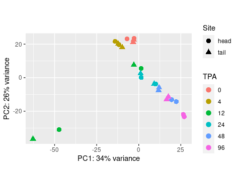
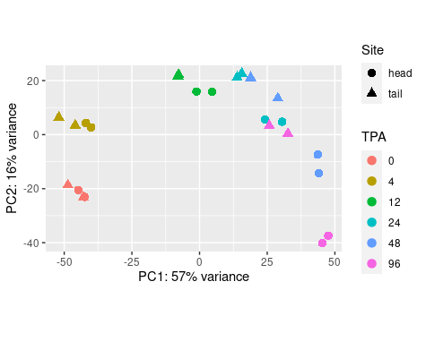
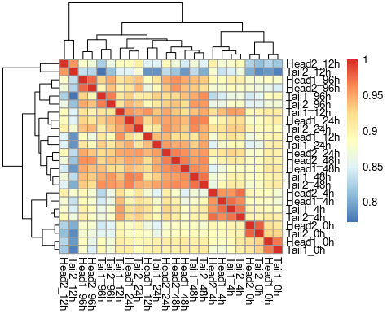
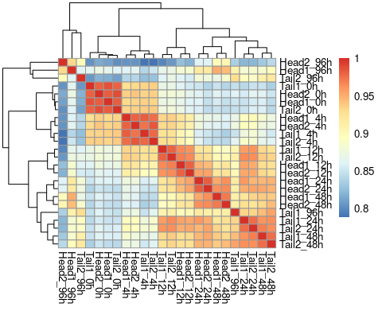
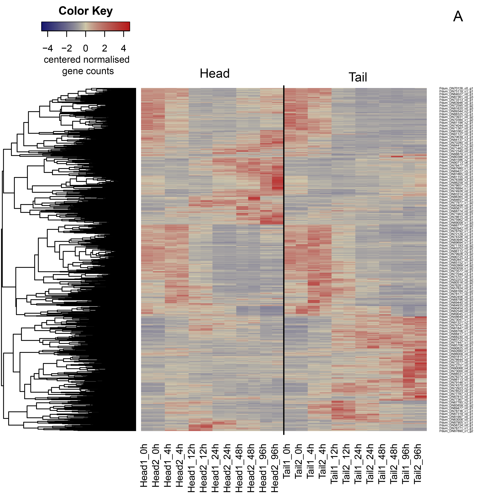
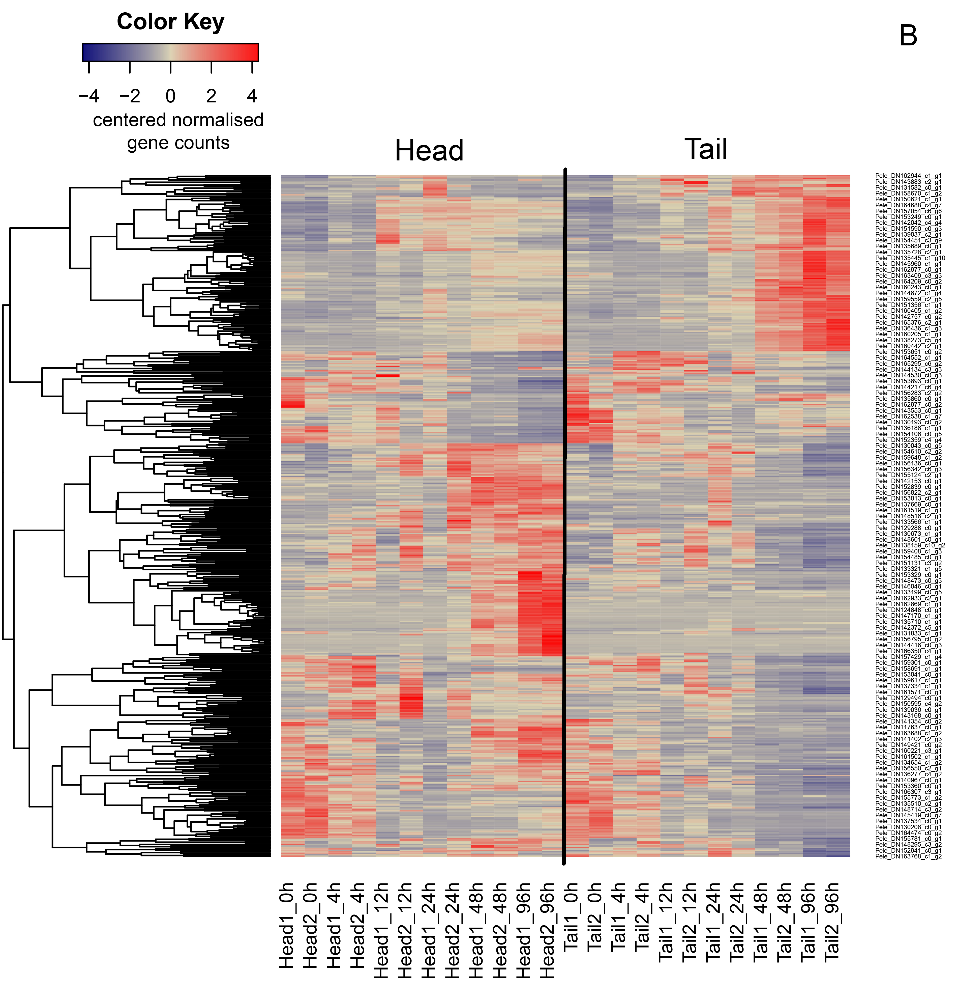

# Transcriptome analysis of anterior and posterior regeneration sites in two annelida families (Nereididae and Spionidae)

## Introduction

It is known that annelids have a great ability to regeneration. However, in some families, the patterns of regeneration depends on the site where it occurs. Thus, annelids from the family Nereididae are able to restore the posterior end of the body, but are not capable of restoring the anterior end. Another family of annelids, Spionidae, successfully restores both the anterior and posterior ends of the body.

Possible explanations for this phenomenon can be provided by a comparative analysis of differential gene expression in the sites of regeneration. In this small project we tried to analise transcriptomic data from six time points after regeneration starts in two species of annelids: *Platynereis dumerilii* (Nereididae) and *Pygospio elegans* (Spionidae).

## Aim and tasks

**Aim:** to identify genes that show differential expression in two sites at different stages of regeneration in *Platynereis dumerilii* and *Pygospio elegans*.

**Objectives:**
* To identify genes that activate or suppress their activity at different stages of regeneration compared to the control point (for both objects at each site of regeneration)

* To determine the biological processes these genes involved (using GO classification)

## Methods

For this project we used 48 *de novo* assemblied transcriptomes from pasterior and anterior regeneration sites for six time points in two species (two replics for each time point). We analised gene raw counts after [Salmon](https://combine-lab.github.io/salmon/) quantification tool (v. 1.1.0).

The differential expression of genes was estimated with [DESeq2](https://bioconductor.org/packages/release/bioc/html/DESeq2.html) R package (v. 1.34.0). We used method for time series analysis based on representation time series as continuous function (described in [Fischer et al, 2018](https://doi.org/10.1093/nar/gky675)). Additional analysis and graphs was provided with R (v. 4.2.0). R scripts are available for separate site analysis and for both sites together (files `Deseq2_analysis_single_site.R` and `Deseq2_analysis_both_sites.R` resp.)

## Results

Exploratory data analysis showed, that two points of *P. elegans* transcriptomes (both are 12h time points) differs greately from other.

PCA plot for *P. elegans*| PCA plot for *P. dumerilii*
-|-
 | 

*Site - site of regeneration 
TPA - time post amputation (hours)*

Pairwise correlation plot for *P. elegans*| Pairwise correlation plot for *P. dumerilii*
-|-
 | 

4085 out of 28613 genes showed differential expression in *Platynereis dumerilii* as a result of DESeq2 analysis using regeneration site as condition: 1612 was overexpressed and 2473 was downexpressed.

And only 465 out of 31225 genes showed differential expression in *Pygospio elegans* in the same analysis: 172 overexpressed and 293 downexpressed.

The DE analysis sites as separate data detect much more DE genes. The results and graphs for separate sites can be found in `additional_graphs` folder.

## Conclusions

We found out genes that shows differential expression in two species of annelids. The further analysis e.g. annotation, gene expression clustering, search for orthologs had already done before this project starts. However, we were not able to obtain meaningful results from them.

## References

David S Fischer, Fabian J Theis, Nir Yosef, Impulse model-based differential expression analysis of time course sequencing data, Nucleic Acids Research, Volume 46, Issue 20, 16 November 2018, Page e119, https://doi.org/10.1093/nar/gky675
